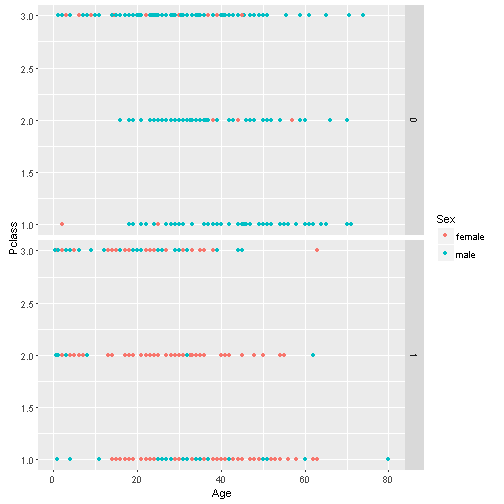

RMS Titanic Sinking Exercise: Shiny Web Application Pitch Presentation
========================================================
author: Teuton2015
font-family: 'Helvetica'
date: Thu Jan 28 14:54:01 2016
autosize: true
transition: concave

RMS Titanic Sinking: Pitch Presentation Content
========================================================

<small>Image source: <https://kaggle2.blob.core.windows.net/competitions/kaggle/3136/logos/front_page.png></small>

1. Purpose and Information
2. Embedded R Code  
3. Instructions for Reproducing Locally

1. Purpose and Information
===
<small>This Shiny application is my submission for the assignment of the course “Developing Data Products”, part of the Data Science Specialization offered by the Johns Hopkins University on Coursera. It is an interactive web based application, frameworked in R, for fetching information on the sex, age, and passenger class of the survivors of the RMS Titanic which sunk on April 15, 1912.

The dataset, found on Kaggle.com, <https://www.kaggle.com/c/titanic/data>, contains 891 records with several identification characteristic variables, and it is popular for many enthusiastic neophytes in machine learning.

* My Shiny application can be found on: <https://teuton2015.shinyapps.io/MyShinyApp/>
* My GitHub repository for this project, with all the working files, is found on: <https://github.com/Teuton2015/Developing_Data_Products.git></small>

2. Embedded R Code
========================================================
<small>library(ggplot2) was used for the plotting. Here is the code for a static view of the default plot that is rendered on the web app:</small>

```r
library(ggplot2)
trainData <- read.csv("train.csv")
g <- ggplot(trainData, aes(Age, Pclass))
g + geom_point(aes(color=Sex)) + facet_grid(Survived ~.)
```



3. Instructions for Reproducing Locally
========================================================
For reproducing this project locally on your computer, you would need to follow these steps:

1. Install the necessary packages to run RStudio’s Shiny server locally, as instructed here: <http://shiny.rstudio.com/articles/shinyapps.html>

2. Run the following command in RStudio:

> runGitHub(“MyShinyApp”, “Teuton2015”)
